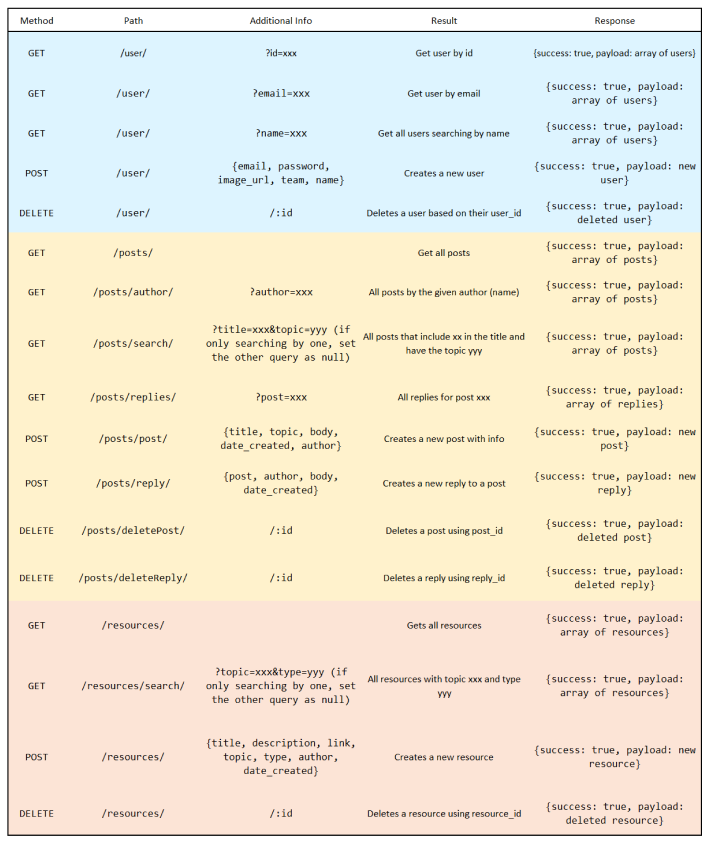

# Lo-code-motive Onboarding Platform - Backend

This is the backend for our onboarding platform, designed to improve the entry process
for a new job. It includes a personalised home page, forum with posts and replies, and
resources collection with various search methods to make finding things easier.

## Authors

- [@Elspeth-57](https://www.github.com/Elspeth-57)
- [@romanhadjisergis](https://www.github.com/romanhadjisergis)
- [@conwys](https://www.github.com/conwys)
- [@CameronMynett](https://www.github.com/CameronMynett)

## Environment Variables

To run this project, you will need to add the following environment variables to your .env file

`PORT`

`DATABASE_URL`

## Deployment

This project is deployed at ...

## Run Locally

Clone the project

```bash
  git clone https://github.com/SchoolOfCode/bc13_final-project_back-end-locodemotives.git
```

Install dependencies

```bash
  npm install
```

Start the development server

```bash
  npm run dev
```

## API Reference


